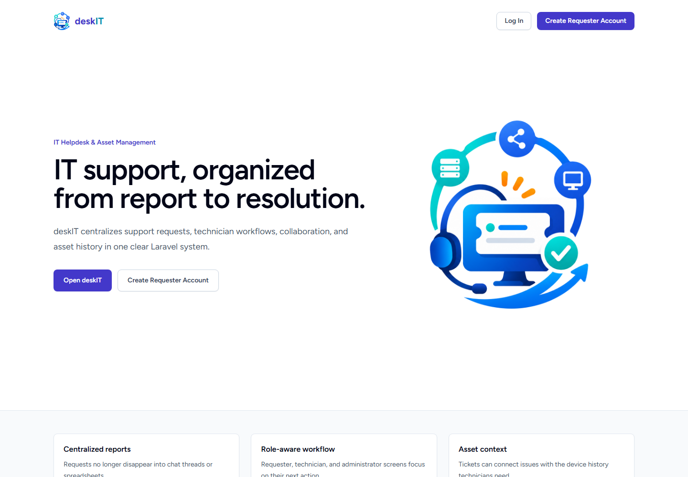
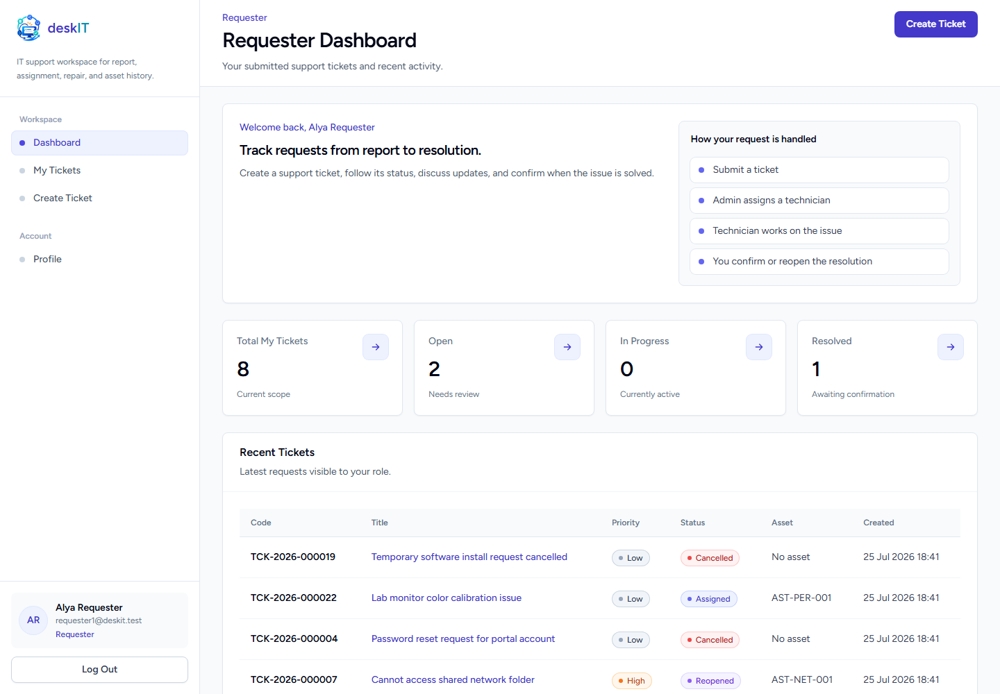
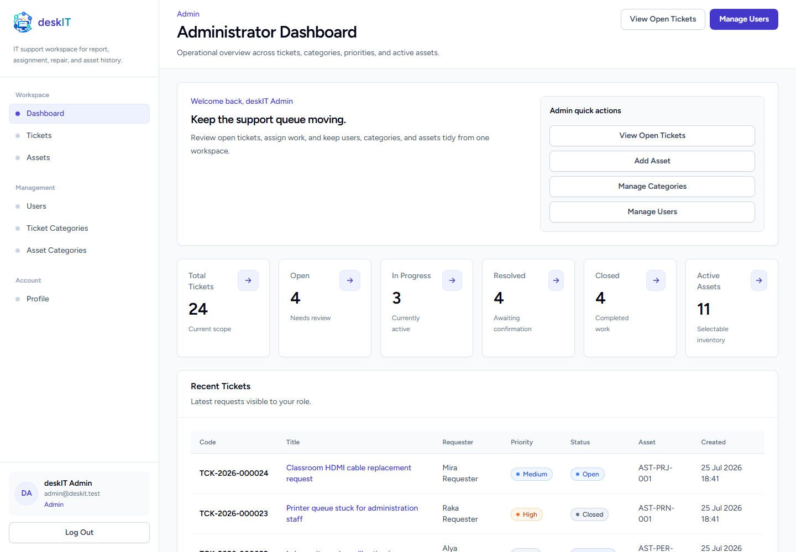
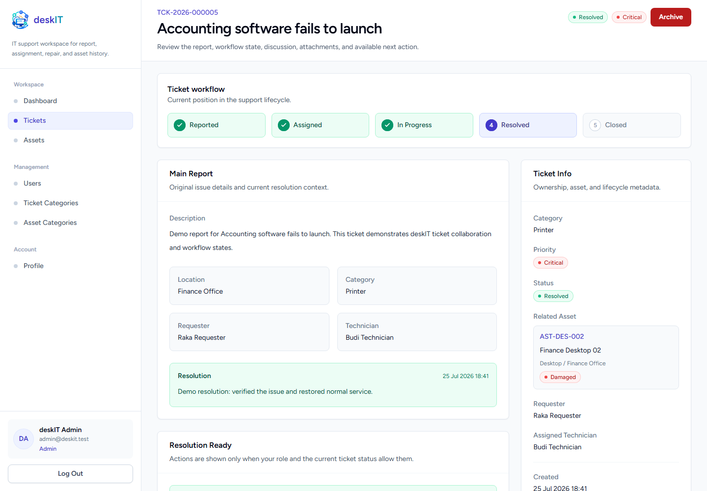
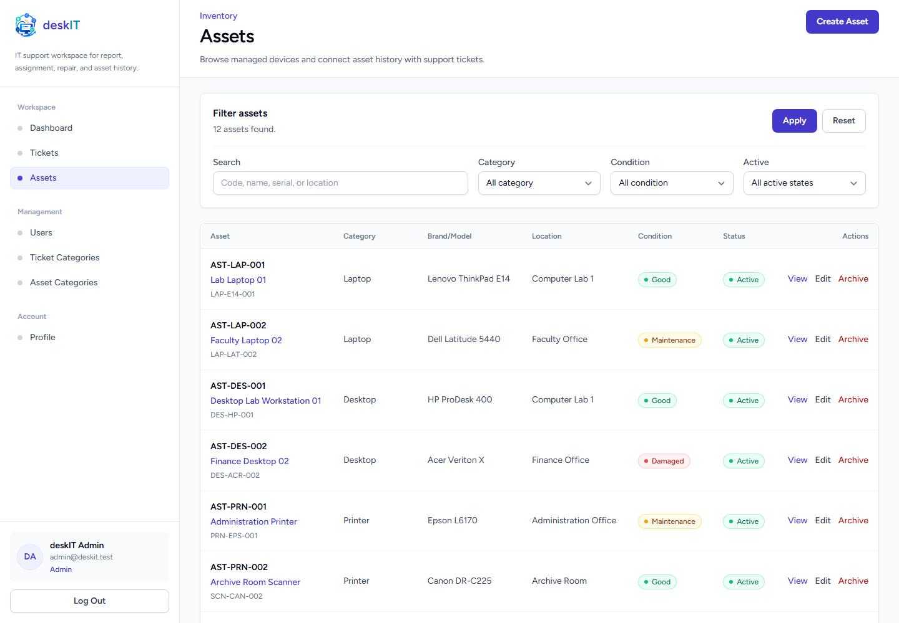
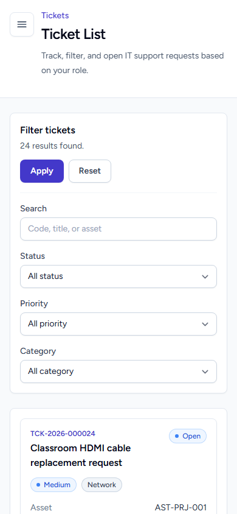
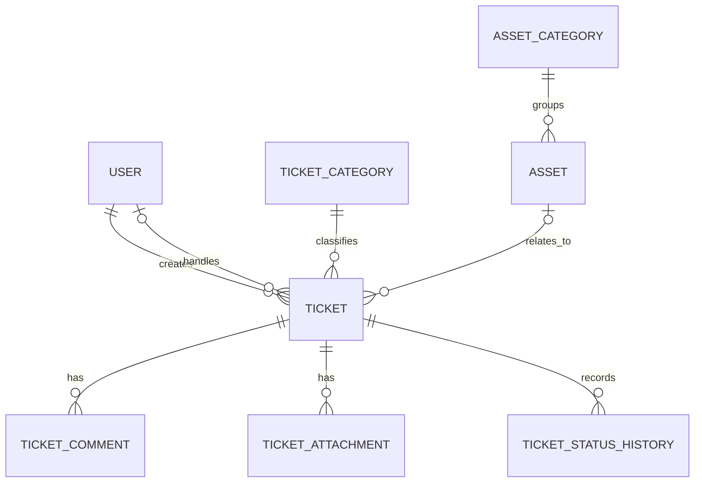

# deskIT

<p align="center">
  
</p>

[](https://github.com/RonyPangaribuan/IT-Helpdesk-and-Asset-Management-System/actions/workflows/ci.yml)
[](LICENSE)

deskIT is an IT Helpdesk & Asset Management application built as a Laravel monolith. It centralizes support requests, technician assignments, issue progress, resolutions, collaboration, and basic asset records in one role-aware workspace.

**Status:** Feature-complete MVP — v1.0.0 Release Candidate

## Overview

IT support reports are often scattered across chat, verbal conversations, and spreadsheets. Requests can be missed, users have limited progress visibility, and repair histories become difficult to trace.

deskIT provides a structured ticket lifecycle for campuses, organizations, and small companies. Requesters report issues, administrators coordinate work, and technicians document progress and resolution while the application preserves comments, private attachments, status history, and related asset context.

## Application Preview

All screenshots below were captured from the running application with local demo data.

### Landing Page



### Role-Based Dashboards

| Requester | Administrator |
| --- | --- |
|  |  |

### Ticket Workflow



### Asset Management and Mobile View

| Asset Management | Mobile Interface |
| --- | --- |
|  |  |

## Key Features

- Laravel Breeze authentication with public registration restricted to requester accounts.
- Administrator, technician, and requester roles with active-account enforcement.
- Ticket creation, scoped listing, editing, archive, search, filters, and pagination.
- Technician assignment, reassignment, and controlled status transitions.
- Read-only ticket status history for important workflow events.
- Ticket comments and private JPG, JPEG, PNG, or PDF attachments up to 5 MB each.
- Ticket category and asset category management.
- Basic asset management with search, filters, archive, and condition tracking.
- Optional ticket-to-asset relationships and role-scoped asset history.
- Role-based dashboards backed by current database data.
- Administrator user management with safeguards for active work and the final administrator.
- Automated feature and unit tests plus GitHub Actions CI.

## User Roles

| Role | Main Responsibilities |
| --- | --- |
| **Requester** | Create and monitor own tickets, comment, upload attachments, and close or reopen resolved tickets. |
| **Technician** | Handle assigned tickets, start work, collaborate, upload attachments, write resolution notes, and resolve work. |
| **Administrator** | View all tickets, assign or reassign technicians, manage users, categories, and assets, and monitor operational data. |

## Ticket Workflow

```text
Open -> Assigned -> In Progress -> Resolved -> Closed
```

- A requester can reopen a Resolved ticket when the issue remains.
- A Reopened ticket can return to Assigned or In Progress.
- Eligible Open or Assigned tickets can be cancelled.
- Closed and Cancelled tickets are read-only.
- Every important transition creates a status-history record.

## Technology Stack

| Area | Technology |
| --- | --- |
| Backend | PHP 8.2+, Laravel 12 |
| Frontend | Blade, Tailwind CSS, Alpine.js |
| Database | SQLite for local/testing; MySQL or PostgreSQL for production |
| ORM | Eloquent |
| Authentication | Laravel Breeze |
| Build | Vite |
| Testing | PHPUnit |
| Code quality | Laravel Pint, Composer Audit |
| CI | GitHub Actions |

## Architecture

deskIT is a single deployable Laravel application with server-rendered Blade views. It keeps validation, authorization, workflow operations, persistence, and presentation within clear framework boundaries:

- Routes define HTTP endpoints.
- Controllers coordinate requests and responses.
- Form Requests validate and authorize input.
- Policies and middleware enforce role and resource access.
- Services manage ticket workflow, attachments, dashboard queries, and user-management rules.
- Eloquent models define domain relationships.
- Blade components provide reusable interface elements.

## Database Overview

The main application tables are:

- `users`
- `ticket_categories`
- `asset_categories`
- `assets`
- `tickets`
- `ticket_comments`
- `ticket_attachments`
- `ticket_status_histories`



## Local Installation

### Windows PowerShell

```powershell
git clone https://github.com/RonyPangaribuan/IT-Helpdesk-and-Asset-Management-System.git
cd IT-Helpdesk-and-Asset-Management-System
composer install
npm.cmd install
copy .env.example .env
New-Item -ItemType File -Path database/database.sqlite -Force
php artisan key:generate
php artisan migrate:fresh --seed
npm.cmd run build
php artisan serve
```

### Linux and macOS

```bash
git clone https://github.com/RonyPangaribuan/IT-Helpdesk-and-Asset-Management-System.git
cd IT-Helpdesk-and-Asset-Management-System
composer install
npm install
cp .env.example .env
touch database/database.sqlite
php artisan key:generate
php artisan migrate:fresh --seed
npm run build
php artisan serve
```

The local environment defaults to SQLite. After starting the server, open `http://127.0.0.1:8000`.

## Demo Accounts

All demo accounts use the password `password`.

| Role | Email |
| --- | --- |
| Administrator | `admin@deskit.test` |
| Technician | `technician1@deskit.test` |
| Technician | `technician2@deskit.test` |
| Requester | `requester1@deskit.test` |
| Requester | `requester2@deskit.test` |
| Requester | `requester3@deskit.test` |

These accounts and their password are for local demonstration only. Never reuse them in production, and do not run the demo seeder in production without an explicit decision.

## Testing and Code Quality

```bash
php artisan test
vendor/bin/pint --test
composer validate --strict
composer audit --locked
```

Frontend production build:

```bash
npm run build
```

Use `npm.cmd run build` on Windows when the PowerShell npm shim is unavailable.

The `CI` workflow runs for pull requests targeting `master`, pushes to `master`, and manual dispatches. Its `laravel-quality` job performs:

- Composer validation and dependency installation.
- Composer security audit.
- Laravel migration and demo seeding.
- Laravel Pint verification.
- Vite production build.
- PHPUnit feature and unit tests.
- Config, route, and Blade view cache verification.

## Security

- Policies and middleware protect role-specific and resource-specific actions.
- Ticket visibility is scoped to the requester, assigned technician, or administrator.
- Public registration always creates an active requester account.
- Inactive accounts cannot log in, and active sessions are invalidated after deactivation.
- Laravel Breeze applies login rate limiting and passwords are hashed by Laravel.
- Ticket attachments are stored on a configurable non-public disk.
- Attachments are downloaded only through an authorized controller action.
- Ticket attachments do not require a public storage URL or `storage:link`.
- Production must use `APP_DEBUG=false`; demo credentials must never be reused.

For production, start from `.env.production.example`, serve only the `public/` directory over HTTPS, use persistent private attachment storage, back up the database and attachments, and run `php artisan migrate --force` without demo seeding. No production deployment is claimed by this repository.

## Known Limitations

- No REST API.
- No React, Vue, or Inertia frontend.
- No real-time chat or WebSocket workflow.
- No production email delivery configuration.
- No artificial intelligence or automatic ticket classification.
- No QR or barcode workflow.
- No PDF or Excel export.
- No SLA automation.
- No procurement or depreciation modules.
- No multi-tenant architecture.
- Production deployment has not been verified.

## Project Status

**Feature-complete MVP — v1.0.0 Release Candidate**

Core features, automated tests, CI, UI polish, and deskIT branding are complete. Production deployment and a formal GitHub Release remain separate final steps.

## License

This project is licensed under the MIT License. See [LICENSE](LICENSE) for details.
