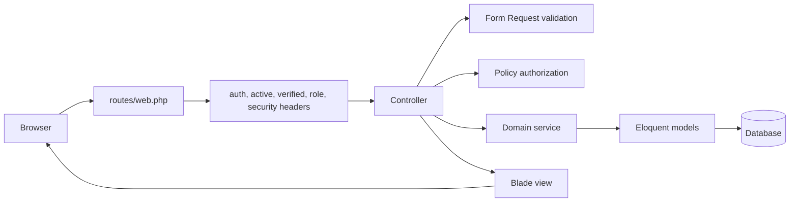

# Architecture

deskIT is a Laravel monolith using Blade and Tailwind CSS. The application keeps the MVP simple: one deployable Laravel app, server-rendered views, Eloquent ORM, Form Requests, policies, middleware, services, migrations, factories, seeders, and feature tests.

## Request Lifecycle

## Application Layers

### Controllers

Controllers coordinate HTTP requests and responses. They stay thin and delegate validation to Form Requests, authorization to policies, and multi-step business behavior to services.

Key controllers:

- `DashboardController`
- `TicketController`
- `TicketAssignmentController`
- `TicketWorkflowController`
- `TicketCommentController`
- `TicketAttachmentController`
- `AssetController`
- `Admin\TicketCategoryController`
- `Admin\AssetCategoryController`
- `Admin\UserController`

### Form Requests

Form Requests validate user input and authorize resource-specific mutations. They normalize small details such as empty optional IDs and trimmed strings before validation.

Examples:

- `StoreTicketRequest`
- `UpdateTicketRequest`
- `AssignTicketRequest`
- `StoreTicketAttachmentRequest`
- `StoreAssetRequest`
- `UpdateAssetRequest`
- `StoreUserRequest`
- `UpdateUserRequest`

### Policies

Policies enforce resource authorization:

- `TicketPolicy`
- `TicketCommentPolicy`
- `TicketAttachmentPolicy`
- `AssetPolicy`
- `UserPolicy`

Role middleware protects admin-only route groups, while policies protect resource-level actions.

### Services

Services hold workflows that should not live entirely in controllers:

- `TicketWorkflowService` creates tickets, assigns technicians, transitions statuses, and records history inside transactions.
- `TicketAttachmentService` stores private files and rolls back stored files if database work fails.
- `DashboardService` builds role-scoped dashboard counts and recent ticket data.
- `UserManagementService` applies admin user-management rules such as last active admin protection and ticket dependency checks.

### Eloquent Models

Models represent the core domain:

- `User`
- `Ticket`
- `TicketCategory`
- `TicketComment`
- `TicketAttachment`
- `TicketStatusHistory`
- `Asset`
- `AssetCategory`

Enums keep status, priority, and asset condition values consistent:

- `TicketStatus`
- `TicketPriority`
- `AssetCondition`

### Blade Views

The MVP frontend uses Blade templates and Tailwind CSS. Tables use horizontal overflow wrappers or mobile card alternatives, forms use labels and validation errors, and navigation adapts to the authenticated role.

Alpine.js is limited to small interactions such as the mobile navigation, confirmation modal, and transient profile feedback.

## Private Storage

Ticket attachments are stored on `config('deskit.attachment_disk')`, which defaults to `local`. The local disk points to private storage. Files are downloaded through `TicketAttachmentController` only after policy authorization.

The app does not create public attachment URLs and does not require `storage:link` for private ticket files. The configured attachment disk must remain private and persistent in production.

## Authentication And Authorization

Laravel Breeze handles session authentication and password reset scaffolding. Public registration always creates active requester accounts.

Inactive accounts are blocked in `LoginRequest`. If an already-authenticated user is later deactivated, `EnsureUserIsActive` logs them out, invalidates the session, regenerates the CSRF token, and redirects to login.

Resource scope remains role-specific:

- Requesters see their own tickets and cannot access asset inventory.
- Technicians see assigned tickets and have read-only asset access.
- Administrators see all tickets and manage assignment, users, categories, and assets.

User-management rules prevent an administrator from deactivating or demoting themself, preserve at least one active administrator, prevent deactivation of technicians with active assigned work, and reject role changes that would invalidate requester or technician history.

## Dashboard Scope

`DashboardService` applies the same role boundaries as ticket listing:

- Requester totals and recent records are limited to tickets they submitted.
- Technician totals and recent records are limited to tickets assigned to them.
- Administrator totals include all non-archived tickets, category and priority breakdowns, and selectable active assets.

## Database Relationships

Main relationships are documented in `docs/ERD.md`. Important rules:

- A ticket belongs to one requester.
- A ticket may belong to one technician.
- A ticket may belong to one asset.
- A ticket has many comments, attachments, and status histories.
- Assets belong to asset categories.
- Tickets and assets use archive behavior instead of permanent deletion.

## CI Workflow

GitHub Actions workflow `CI` runs job `laravel-quality` on pull requests to `master`, pushes to `master`, and manual dispatch. It validates Composer, installs dependencies, audits Composer dependencies, runs migrations and seeders, checks Pint, builds Vite assets, runs Laravel tests, verifies Laravel cache commands, and clears optimized files.
