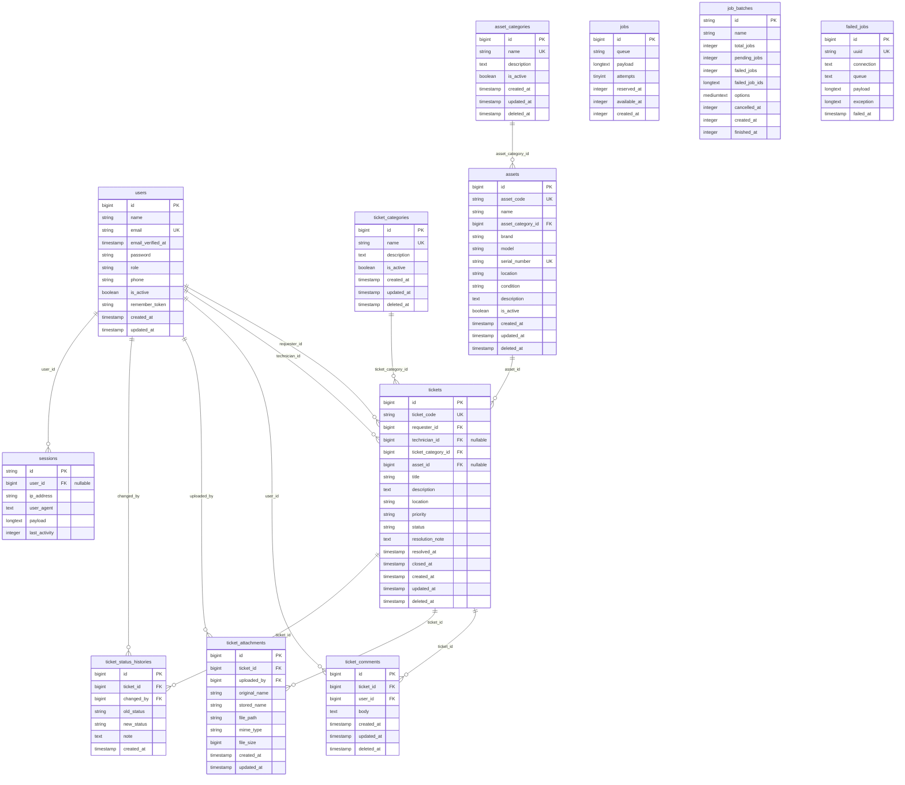

# Entity Relationship Diagram

This ERD follows the actual Laravel migrations in this repository.

Notes:

- `tickets.technician_id` is nullable until an administrator assigns a technician.
- `tickets.asset_id` is nullable because tickets can be created without a related asset.
- Ticket, category, comment, and asset archive behavior uses soft deletes where implemented.
- Attachments are private files referenced by database metadata and served through authorization.
